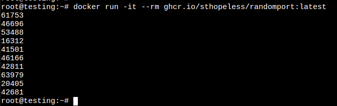

# Random Port Generator (x10)

Script used to generate ports for my docker (and others..) templates

```docker run -it --rm ghcr.io/sthopeless/randomport:latest```  
or with sudo   
```sudo docker run -it --rm ghcr.io/sthopeless/randomport:latest```  


